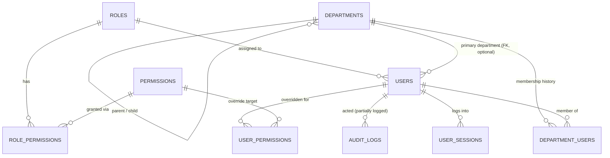

# Understanding the Administration & RBAC Architecture

This document exists so you can own this codebase without needing anyone (or any AI) to re-explain it. It describes what actually exists today — not what the module was intended to become. Every claim below was checked against the code directly; file paths are given throughout so you can verify anything yourself. No code was changed to produce this document.

## Part 1 — Administration Overview

**Users.** Business purpose: represent the people at the customer's company who log in and do work — QA staff, production staff, administrators. Technical purpose: the `users` table is the anchor identity row that almost everything else in the system points back to (created_by/updated_by/approved_by columns across dozens of other tables). Implemented in `backend/app/models/user.py` (model), `backend/app/api/v1/endpoints/users.py` (CRUD), `frontend/src/pages/Users.tsx` (UI), `frontend/src/store/slices/authSlice.ts` (session state). Status: complete for the basics — create, edit, deactivate (soft delete only, no hard delete), admin-triggered password reset, and a per-user custom-permission override dialog all work. Not complete: no bulk import, no email-based invitation (a new user's password is just set directly by whoever creates the account). Actively used — this is the most solid part of Administration.

**Authentication.** Business purpose: control who can get into the system at all. Technical purpose: issue and validate JWTs, track login attempts, lock accounts after repeated failures. Implemented in `backend/app/core/security.py` (hashing, token creation/verification, lockout), `backend/app/api/v1/endpoints/auth.py` (login, signup, register, refresh, logout, change-password), `frontend/src/pages/Login.tsx`, `frontend/src/pages/Signup.tsx`. Status: functional for login/logout/token-refresh, but the account-creation story is muddled — there are three different ways to create a user (self-service `/signup`, `/register` with an explicit role, and admin-only `POST /users/`) and they don't share one consistent gate (more in Part 7). No forgot-password flow exists despite a `PasswordReset` model sitting unused in `user.py`. Used constantly (every login goes through this), but the parts beyond login/logout are inconsistently used.

**User Profile (self-service).** Business purpose: let a logged-in person manage their own account. Technical purpose: a scoped-to-self version of user data plus password/avatar/preferences. Implemented in `backend/app/api/v1/endpoints/profile.py`, `frontend/src/pages/Profile.tsx`. Status: complete and in active use — profile edit, change password, avatar upload, preferences, and read-only activity/security tabs (failed login count, lock status) all work.

**Roles.** Business purpose: define job functions (QA Manager, Production Manager, etc.) so permissions can be assigned once per function instead of per person. Technical purpose: the `roles` table, with a `Role` ↔ `Permission` many-to-many. Implemented in `backend/app/models/rbac.py`, `backend/app/services/rbac_service.py`, `backend/app/api/v1/endpoints/rbac.py`, `frontend/src/pages/RBAC.tsx` (Roles tab). Status: structurally complete — full create/edit/clone/delete UI exists, deletion is correctly blocked while users are still assigned to a role. The real gap isn't the feature, it's that three different seed scripts create three different role sets with three different permission assignments (detailed in Part 2) — whichever one was run last is what actually exists in a given deployment.

**Permissions.** Business purpose: the specific things a role is allowed to do (view/create/update/delete/approve/etc. on a given module). Technical purpose: a flat `permissions` table (one row per module+action combination) plus a `user_permissions` override table for per-person exceptions. Implemented in the same `rbac.py`/`rbac_service.py`/`rbac.py` endpoint files, `frontend/src/pages/RBAC.tsx` (Permission Matrix tab), per-user overrides in `Users.tsx`. Status: the matrix view and role-permission assignment work. The per-user override table is grant-only — you can add a permission to one user, but a `granted=False` row does nothing if that user's role already grants the same permission (there's no revoke-below-role-level mechanism). Used, but lightly — most environments will rely on role-level permissions rather than the per-user override dialog.

**Departments.** Business purpose: represent the organizational units a food manufacturer actually has — QA, Production, Maintenance, etc. — for both user assignment and document tagging. Technical purpose: `departments` + `department_users` tables, with parent/child hierarchy and time-bounded department membership. Implemented in `backend/app/models/departments.py`, `backend/app/api/v1/endpoints/departments.py`, `frontend/src/services/departmentsAPI.ts`. Status: **this is the module's biggest gap.** The backend is fully built — hierarchy, a department manager field, indexed queries, a proper join table for multi-department membership with start/end dates — but no seed script ever inserts a row into it, and no frontend page exists to create, edit, or archive a department. The only frontend usage is `departmentsAPI.list()` being called from Users/Documents/Objectives/Audits pages purely to populate a read-only dropdown. In practice, departments in this system today are either empty, or were created by someone calling the API directly (curl/script), because there is no "Departments" admin screen.

**Locations / Sites / Facilities.** Not found as a model. There is no `Site`, `Location`, `Facility`, or `Plant` table anywhere in the codebase. The closest thing is a single free-text setting, `facility_address` (`backend/app/schemas/settings.py`), which holds one address for the entire company. A food manufacturer with more than one plant has no way to represent that in this system today.

**Teams.** Not found. No `Team` model exists. There's a single settings field, `haccp_team_leader` (a name typed into Settings), but no roster/team entity behind it.

**Organization / Company Settings.** Business purpose: capture identity info about the customer's company (name, address, contacts) and configure system behavior (session timeout, alert thresholds, retention periods). Technical purpose: `ApplicationSetting`, a flat key-value table (`backend/app/models/settings.py`), rendered by category in `frontend/src/pages/Settings.tsx`. Status: functional, but company-identity fields (`company_name`, `facility_address`, `contact_email`, `contact_phone`) live in the exact same undifferentiated list as pure technical settings (ERP integration toggle, password policy, retention days) — there's no distinct "Organization Profile" section. No `Organization` entity exists; "the company" is just a few rows in this generic settings table.

**System Configuration.** Same feature as Organization Settings above — one page, one model, one table, covering everything from HACCP alert thresholds to session timeout to report format defaults.

**Admin Activity / Audit Logging.** Business purpose: for an ISO 22000 system, being able to show an auditor "who changed this user's role, and when" matters. Technical purpose: `AuditLog` model (`backend/app/models/audit.py`) plus a `log_audit_event()` helper (`backend/app/services/__init__.py`). Status: **partial, and this matters.** It's called for login, logout, token refresh, registration, and password changes, and for department-field changes on a user — but creating, editing, deleting, activating, or deactivating a user does **not** get logged (except the one department-change branch), and none of the role or permission management endpoints (`rbac.py`) call it at all. Today, if someone changes what a role can do, or deletes a permission, there is no audit trail of that action. (Don't confuse this with `ActionLog`, `HACCPAuditLog`, or the ISO "Audit Management" module — those are unrelated, domain-specific logs.)

**Sessions.** Business purpose: know which login is currently active. Technical purpose: `UserSession` table, one row created per login, invalidated on logout or a new login (only one active session per user at a time). Status: functional as a login-tracking mechanism, but there's no admin UI to view or forcibly revoke another user's active session — only your own security info is visible, in Profile.tsx.

## Part 2 — Company Setup Workflow (as it actually works today)

This is the real sequence, not an idealized one. Steps marked "manual, no UI" mean someone has to do this by running a script or calling the API directly — there's no button for it.

**1. Deploy the database schema.** There's one Alembic migration (`backend/alembic/versions/a1b0c0000001_initial_baseline.py`), and it doesn't contain hand-written DDL — it just imports every model and calls `Base.metadata.create_all()`. This creates every table, empty. No seed data ships with the schema itself.

**2. Seed roles and permissions — manual, and inconsistent.** Someone has to run one of three scripts that all do this differently: `ensure_default_roles.py` creates 2 roles (System Administrator, QA Manager); `initialize_database_complete.py` (the one that calls itself canonical in its own docstring) creates 4 roles (System Administrator, QA Manager, Production Manager, Line Operator) with deliberately hand-picked permission sets; `setup_database_complete.py` creates 10 roles with permission assignment done by numeric ID arithmetic rather than a deliberate per-role decision (every role except the top two ends up with identical view-only access to everything, regardless of what the role is named). Whichever script gets run determines what a fresh deployment actually looks like — nothing in the codebase reconciles these.

**3. First administrator account.** Either created directly by `initialize_database_complete.py` (one `admin` user, tied to the System Administrator role, inserted via ORM) or created through the `/signup` page — which is labeled "System Administrator Registration" in the UI (`Signup.tsx`) but whose backend route actually assigns whichever role is flagged `is_default=True` in the database, not necessarily System Administrator. Worth confirming directly in whatever seed script your deployment uses, since the UI's label and the backend's actual behavior aren't guaranteed to match.

**4. Organization — does not happen.** There is no organization/company entity to create. The company's identity is just a couple of fields in Settings, editable any time, not part of a setup wizard.

**5. Departments — manual, no UI.** The table exists and can hold a real hierarchy, but nothing seeds it and there's no admin screen to create one. In practice this step is either skipped (leaving the department dropdown empty everywhere it's used) or done by calling `POST /departments` directly.

**6. Sites — does not happen.** No such entity exists.

**7. Roles — seeded by whichever script ran, then optionally adjusted through the UI.** Beyond the initial seed, `RBAC.tsx` does have a working Create/Edit/Clone/Delete role UI, so an admin can genuinely reshape the role set after the fact.

**8. Permissions assigned — happens inside role creation/editing.** There's no separate "assign permissions" step; picking permissions is part of the role create/edit form.

**9. Users invited — no invitation flow.** A user account is created directly (with a password set then and there) via `POST /users/` from the Users.tsx admin screen, or via self-service `/signup` (default role) or `/register` (caller-specified role — and notably this specific route has no permission gate, unlike the equivalent admin route in `users.py`; worth verifying directly given what that implies). There's no "send an invite email, they set their own password" flow.

**10. Users assigned to departments.** Done through the same User create/edit dialog, by picking from whatever departments exist (often none, per step 5). The richer `DepartmentUser` join table (which supports a user belonging to multiple departments with start/end dates) has a working backend endpoint but zero frontend caller — nothing in the UI uses it.

**11. Users assigned roles.** Mandatory — `User.role_id` is a required field, set at creation and editable later from Users.tsx.

**12. Users begin using Document Control / HACCP.** Gated by two independent things that don't always agree: the sidebar nav's role/permission check (`frontend/src/theme/navigationConfig.ts`) and each module's own backend permission check — which, as documented separately for Document Control, isn't applied consistently (e.g., the document-creation endpoint has no permission gate at all, regardless of what the nav shows).

## Part 3 — RBAC Implementation

**Storage.** Users live in `users` (`backend/app/models/user.py`), one row per person, with a mandatory `role_id` foreign key — **one role per user, not many-to-many.** There is no `user_roles` join table anywhere; the only many-to-many relationship in this system is roles↔permissions. Roles live in `roles`, permissions live in `permissions` (`backend/app/models/rbac.py`), connected by the `role_permissions` association table (composite primary key of role_id + permission_id, both foreign keys cascade on delete). A separate `user_permissions` table lets an individual user be granted an extra permission beyond their role — but it is strictly additive, never subtractive.

**How a permission check actually resolves.** `RBACService.get_user_permissions(user_id)` (`backend/app/services/rbac_service.py`) is the one place this logic lives: take every permission attached to the user's role, add every permission from `user_permissions` where `granted=True`, de-duplicate by permission ID. That combined list is what "does this user have permission X" is checked against. There is no caching — every check is a fresh database query.

**Enforcement — two separate, non-identical implementations exist.** `backend/app/core/permissions.py` defines one style of permission-checking dependency; `backend/app/core/security.py` defines a second, differently-shaped one (it accepts both a `("MODULE","ACTION")` tuple and a legacy `"module:action"` string). Different endpoint files use one or the other. More importantly: across the 38 backend endpoint files, only about a third actually apply either enforcement mechanism — the rest rely on nothing beyond "is this a logged-in user," and a few endpoints (documented separately for Document Control) don't even require that.

**Frontend/backend communication.** At login (or `GET /me`), the backend computes the user's full permission list server-side and sends it down as a flat array of `"module:action"` strings, which gets stored in Redux (`authSlice.ts`) alongside the user's `role_name`. The frontend never re-derives permissions itself — it just checks membership in that array (`usePermissions.ts` hook, and `hasPermission`/`hasRole` helpers in `authSlice.ts`), using an exact, case-insensitive string match. This array is a snapshot taken at login/refresh time — if an admin changes what a role can do while someone is already logged in, that person's frontend won't reflect the change until they log in again.

**Complete request flow, login to authorization:**

1. User submits credentials to `POST /auth/login`. Backend verifies the password hash, checks/increments `failed_login_attempts`, and locks the account for a period if the threshold is exceeded.
2. On success, backend creates a signed JWT access token and a longer-lived refresh token (`core/security.py`), writes a `UserSession` row (invalidating any prior active session for that user), and computes the user's full permission list via `RBACService`.
3. The response carries both tokens plus the user's profile, `role_name`, and permissions array. The frontend stores the tokens in `localStorage` and the user object (including permissions) in Redux.
4. Every subsequent API call attaches the access token as a Bearer header.
5. On the backend, `get_current_user` (`core/security.py`) decodes the token, re-loads the `User` row fresh from the database (so an admin deactivating someone takes effect immediately, unlike the permissions snapshot), and rejects inactive or locked accounts.
6. If the specific route has a permission dependency attached, that dependency calls into `RBACService`/`check_user_permission` again — a fresh query, role permissions ∪ granted user-overrides — and returns 403 if the check fails. If the route has no such dependency, this step simply doesn't happen and any authenticated (or in a few cases, any) request proceeds.
7. Meanwhile, the frontend has already used its login-time permissions snapshot to decide what to show in the UI — which is a convenience layer only. The real gate, where one exists, is step 6.

## Part 4 — Database Model

| Table | Purpose | Key columns | Notable constraints/indexes |
|---|---|---|---|
| `users` | One row per person who can log in | `id` PK; `username`, `email` unique+indexed; `hashed_password`; `role_id` FK→roles.id (NOT NULL, no cascade rule set); `department_id` FK→departments.id (nullable); `department_name` (legacy string duplicate, kept "for backward compatibility"); `status` enum; `is_active`, `is_verified`, `failed_login_attempts`, `locked_until` | No composite constraints beyond column-level uniqueness |
| `user_sessions` | One row per active login | `id` PK; `user_id` (plain integer — **no FK constraint actually declared**, and no `relationship()` back to User); `session_token`/`refresh_token` unique; `expires_at`; `is_active` | Effectively an orphaned table by convention only, not enforced by the schema |
| `password_resets` | Meant to back a forgot-password flow | `user_id` (no FK); `token` unique; `expires_at`; `is_used` | Defined, but no endpoint anywhere creates or consumes a row here — dormant |
| `roles` | Job-function definitions | `id` PK; `name` unique+indexed; `is_default`, `is_editable`, `is_active` booleans | — |
| `permissions` | One row per module+action combination | `id` PK; `module` (string, mirrors the `Module` enum's value, not a DB-level enum); `action` (string, mirrors `PermissionType`) | **No unique constraint on (module, action)** despite being logically unique — enforced only by an application-level check before insert |
| `role_permissions` | Many-to-many join, roles↔permissions | Composite PK (role_id, permission_id); both FKs `ondelete=CASCADE` | — |
| `user_permissions` | Per-user permission overrides (grant-only) | `id` PK; `user_id` FK→users.id CASCADE; `permission_id` FK→permissions.id CASCADE; `granted` boolean; `granted_by` FK→users.id | **No unique constraint on (user_id, permission_id)** — de-duplication is handled in application code, not the database |
| `departments` | Organizational units, with hierarchy | `id` PK; `department_code` unique; `name`; `parent_department_id` FK→departments.id (self-referential); `manager_id` FK→users.id; `status`; `created_by` FK→users.id (NOT NULL) | Indexes on (parent_department_id, status) and (manager_id, status) |
| `department_users` | Time-bounded department membership | `id` PK; `department_id`, `user_id` FKs (both indexed); `role` (free-text label, not FK to `roles`); `assigned_from`/`assigned_until`; `is_active` | Indexes on (department_id, user_id, is_active) and (assigned_from, assigned_until); no unique constraint on (department_id, user_id) — built for multi-department membership over time, but has no frontend caller today |
| `application_settings` | Flat key-value store for both company-identity fields and technical config | `key` (e.g. `company_name`, `session_timeout_minutes`); `value`; `category`; `is_editable` | No structural separation between "who is this company" and "how does the app behave" |
| `audit_logs` | Generic activity log | `user_id`, `action`, `resource_type`, `resource_id`, `details` (JSON), `ip_address`, `created_at` | Only written to by login/logout/refresh/registration/password-change/department-change — not by role/permission changes or most user-management actions |

**Normalization:** mostly reasonable (3NF for the core Role/Permission/User tables), with two deliberate legacy exceptions kept for backward compatibility: `users.department_name` duplicates the relationship already expressed by `users.department_id`, and — outside this table set but relevant — `documents.department` is a plain string with no FK to `departments` at all, meaning Document Control isn't relationally connected to this Department table.

**Migration reality:** every column, foreign key, and index above comes from SQLAlchemy model metadata via a single non-incremental `create_all()` call — there is no hand-written DDL migration history to review for how the schema evolved.

**Seed data, in one line each:** `roles`/`permissions`/`role_permissions` — populated only if you run one of the three conflicting seed scripts (Part 2); `users` — 1 admin row (`initialize_database_complete.py`) or ~12 demo personas (`seed_presentation_demo.py`/`populate_professional_data.py`); `departments`/`department_users` — **zero rows from any seed script that exists today**; `user_sessions`/`user_permissions`/`password_resets` — runtime-only, never seeded.

**ER diagram:**

## Part 5 — Code Organization

**Authentication:** `backend/app/core/security.py` (hashing, JWT, lockout logic), `backend/app/api/v1/endpoints/auth.py` (login/signup/register/refresh/logout/change-password routes) — exists to answer "is this a valid, currently-usable account."

**Users:** `backend/app/models/user.py` (User, UserSession, PasswordReset), `backend/app/api/v1/endpoints/users.py` (admin CRUD), `backend/app/api/v1/endpoints/profile.py` (self-service) — exists to represent and manage people.

**Roles & Permissions:** `backend/app/models/rbac.py` (Role, Permission, UserPermission, role_permissions), `backend/app/services/rbac_service.py` (all the resolution/CRUD logic), `backend/app/api/v1/endpoints/rbac.py` (the API surface) — exists as the single place that decides what a role or user is allowed to do.

**Departments:** `backend/app/models/departments.py`, `backend/app/api/v1/endpoints/departments.py`, `frontend/src/services/departmentsAPI.ts` — exists to represent organizational units, though (per Part 1) it's the least-used piece relative to how much backend exists for it.

**Services (backend):** `backend/app/services/rbac_service.py` is the only Administration-specific service class; general audit logging lives in `backend/app/services/__init__.py` (`log_audit_event`) rather than its own file — worth knowing so you don't go looking for an `audit_service.py` that doesn't exist.

**API (backend):** `backend/app/api/v1/endpoints/{auth,users,profile,rbac,departments}.py` — one file per concern, all mounted through `backend/app/api/v1/api_minimal.py` (the router `main.py` actually uses).

**Frontend pages:** `frontend/src/pages/Login.tsx`, `Signup.tsx`, `Profile.tsx`, `Users.tsx`, `RBAC.tsx`, `Settings.tsx` — Administration is entirely page-level; there's no dedicated `components/Admin/` folder, unlike some other modules that split page vs. component logic.

**Frontend auth guards:** `frontend/src/components/Auth/ProtectedRoute.tsx` (is anyone logged in), `RoleBasedRoute.tsx` (does this role match an allow-list), `AuthProvider.tsx` — exists to keep route-level access checks out of individual page components.

**Frontend services (API clients):** `frontend/src/services/rbacAPI.ts`, `departmentsAPI.ts`, plus auth/user calls inside the shared `frontend/src/services/api.ts` — exists as the one place HTTP calls are made, so pages don't build fetch calls directly.

**State management:** `frontend/src/store/slices/authSlice.ts` (current user, tokens, permissions array, and the `hasRole`/`hasPermission` helper functions used everywhere), `frontend/src/store/slices/rbacSlice.ts` (roles/permissions/role-summary/permission-matrix data for the RBAC page) — exists because this data is needed by many unrelated components (nav, route guards, page-level buttons), not just one page.

**Utilities:** `frontend/src/hooks/usePermissions.ts` (the hook version of the permission-checking helpers, used inside components) — exists alongside, not instead of, the plain functions in `authSlice.ts`; both do the same string-matching check.

**Navigation:** `frontend/src/theme/navigationConfig.ts` — not an Administration file per se, but it's where the "Administration" nav group and its role/permission gates are actually defined (as opposed to some separate menu-config folder).

## Part 6 — Customer Experience

Walking through onboarding a real food manufacturer with this module as it stands today:

Creating users: yes, easily — the Users.tsx admin screen is genuinely complete for this. Assigning roles: yes, both at user creation and afterward. Assigning permissions: yes at the role level (the Permission Matrix and role edit dialog are functional); per-user overrides work but are a secondary, easy-to-miss dialog. Deactivating users: yes, one click, and self-deactivation is correctly blocked. Resetting passwords: yes, but only as an admin action typing a new password directly — there's no "email them a reset link" option, which is what most customers now expect. Creating departments: **no** — there is no screen for this at all; a customer who wants to set up "QA / Production / Maintenance / Warehouse" as departments cannot do it through the product, only through someone calling the API on their behalf. Managing organization structure more broadly: quite limited — no way to represent multiple sites/plants, no dedicated company profile screen (it's mixed into general Settings), no Teams concept for cross-functional groups like a HACCP team.

The single biggest gap a real customer would hit in the first hour of setup is the missing Departments UI — it's the first thing Document Control and user management both ask for (a department dropdown), and there's currently no way to populate it without engineering help.

## Part 7 — Simplification (no code changes, just what I'd do)

**Collapse the three conflicting seed scripts into one.** `ensure_default_roles.py`, `initialize_database_complete.py`, and `setup_database_complete.py` each create a different role set with different permission logic. Only one should exist; the other two are a maintenance and onboarding hazard (whoever runs the "wrong" one gets a different system than whoever wrote the demo script assumed).

**Collapse the duplicate user-creation paths.** `POST /auth/register` and `POST /users/` do the same job (create a user with a specified role) with different gating — the `auth.py` one appears to have no permission or authentication dependency at all, which is worth verifying immediately given the implications. One consistently-gated creation path is enough.

**Unify the two permission-enforcement implementations.** `core/permissions.py` and `core/security.py` both define "check if the current user has permission X" dependencies, with different call signatures, used inconsistently across endpoint files. Pick one.

**Either wire up or remove `PasswordReset`.** The model exists; nothing creates or consumes it. It's either half-finished work or dead weight — right now it's ambiguous which.

**Retire the vestigial `UserRole` enum** in `user.py` — it's not used for authorization anywhere (only a stray comment references it), and its presence next to the real `Role` table is actively confusing for anyone new to the code.

**Decide what to do with `DepartmentUser`.** It's a fully-built, indexed, time-bounded multi-department-membership table with zero frontend callers. Either it's worth building the UI for (if multi-department staff is a real need for this customer) or it should be simplified away in favor of the simpler `User.department_id` that's already doing the actual work.

**Separate "Organization Profile" from "Technical Settings."** They currently live in the same flat `application_settings` table and the same Settings.tsx page. A customer's company name and address are a different kind of thing from a session-timeout number, and treating them the same makes both harder to reason about.

**Close the audit-logging gap for anything Administration touches.** Right now, creating, editing, or deleting a user isn't logged (only login events and one department-change branch are), and no role or permission change is logged at all. For a system whose entire value proposition is regulatory traceability, this is the one gap in this module I'd fix first regardless of anything else on this list.

**Build the missing Departments UI, or drop the hierarchy/time-bounded sophistication to match actual usage.** Right now the backend is more ambitious (parent/child hierarchy, department manager, time-bounded membership) than anything the product actually lets a user do. Either close that gap with real UI, or simplify the backend down to what's actually being used — a flat list of named departments for tagging users and documents.

## Part 8 — Future Blueprint

If this were rebuilt today for a typical single-site (or small-number-of-sites) food manufacturer — not a generic multi-tenant enterprise platform — here's what I'd design toward:

**Core entities:** `Company` (a real, single row — not a settings key — holding name, address, contacts, so it's structurally distinct from technical config), `Department` (flat list with an optional one-level parent if the customer genuinely has sub-departments; drop the time-bounded membership complexity unless a customer actually asks for staff belonging to two departments at once), `User`, `Role`, `Permission`. That's five entities, not more — this customer's stated document-category needs and role structure (from earlier product review) don't call for Sites/Teams/multi-tenancy, and adding them would be exactly the kind of generic enterprise complexity the customer asked to avoid.

**Relationships:** `User → Role` (many-to-one, as today — one role per user is the right level of complexity for this customer size), `Role ↔ Permission` (many-to-many, as today), `User → Department` (many-to-one via a single clean FK — no parallel string field), `Department → Department` (optional self-referential parent, only if truly needed).

**Required services:** one `UserService` (create/edit/deactivate — no duplicate creation paths), one `AuthService` (login/logout/refresh, and this time a real forgot-password flow with an expiring token, since customers will ask for this), one `RBACService` (as exists today — the resolution logic is actually well-designed, it just needs to be the only enforcement path, applied consistently to every module, not roughly a third of them), one `DepartmentService` (paired with an actual admin UI), and one `AuditService` that every one of the above calls on every create/update/delete/activate/deactivate/permission-change — not bolted on afterward.

**Required APIs:** consistent, permission-gated CRUD for users, roles, and departments; a real invite-by-email flow instead of admin-set passwords; a real forgot-password endpoint pair; a company-profile endpoint separate from technical settings.

**Required UI:** a Departments admin screen (the single most obviously missing piece today), a distinct Company/Organization Profile tab separate from technical Settings, and — given this is a compliance product — a visible admin activity log screen, since "who changed this role" is exactly the kind of evidence an ISO 22000 auditor will ask for.

**RBAC model:** keep it simple — one role per user, permissions attached to roles, a grant-only per-user override for genuine exceptions. This is already the right level of sophistication for this customer; the fix needed isn't a redesign, it's consistent enforcement everywhere and database-level constraints (unique module+action on permissions, unique user+permission on overrides) backing up what's currently only checked in application code.

**Organization hierarchy:** `Company → Department → User`, flat and shallow. Add a `Site` layer only the day a customer actually operates more than one physical plant — not before. Resist building for a hypothetical multi-site, multi-tenant future the current customer hasn't asked for; that instinct is what already produced some of the unused sophistication (like `DepartmentUser`) documented above.
